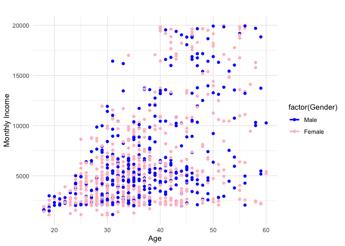
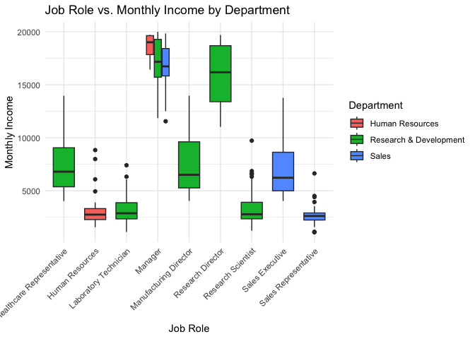
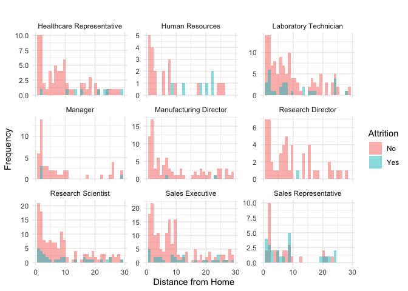
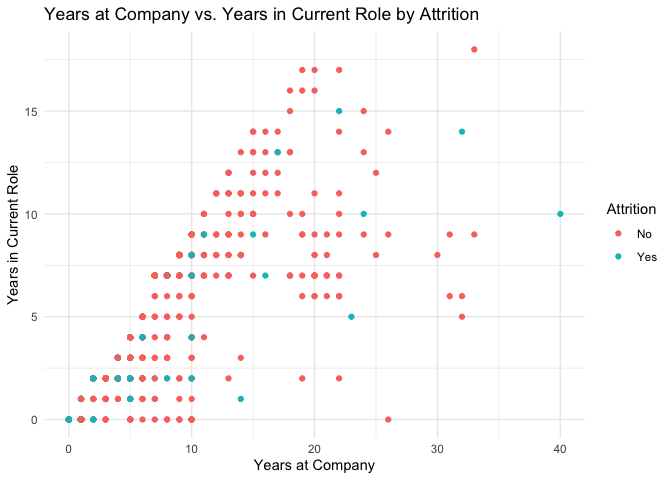
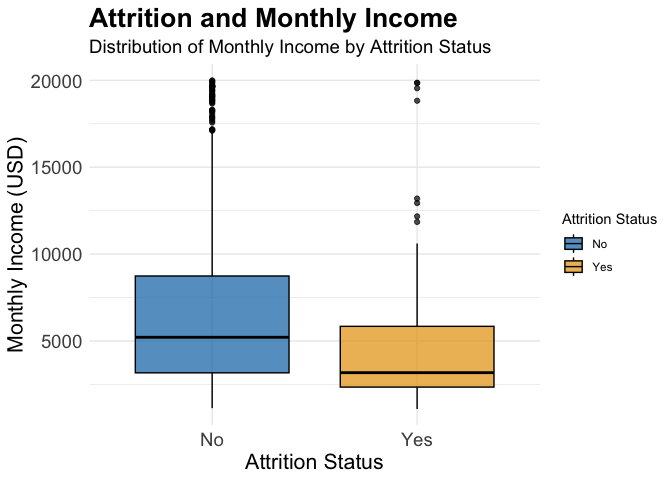
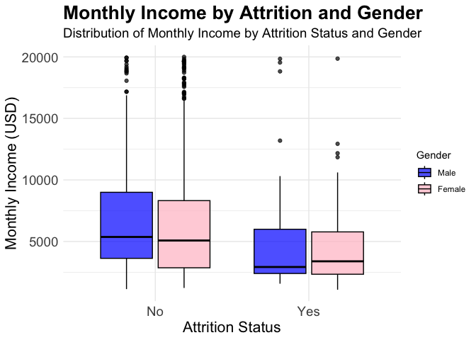
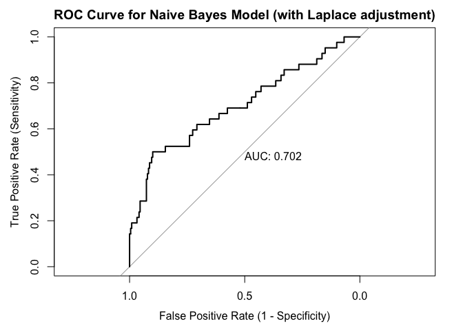
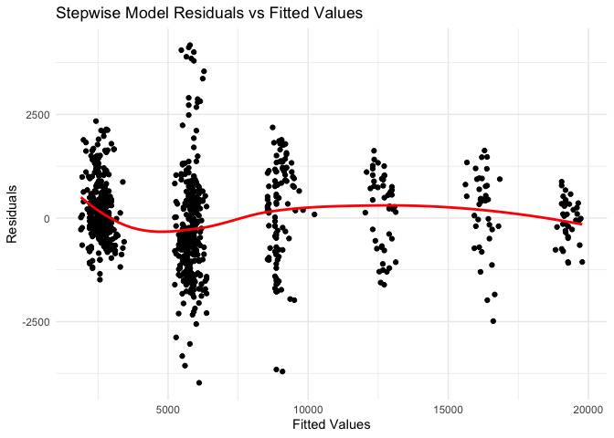

Introduction

In this data analysis project for DDSAnalytics, my primary goal is to identify the top three factors that contribute to employee turnover. Additionally, I will explore job role specific trends, interesting observations, and build a model to predict attrition and monthly income.

The first step in this process is data loading and preprocessing, which involves reading in the provided dataset, splitting it into train and test sets, and converting columns with low unique value counts to factors. I also created several plots to explore the data, such as Age vs Monthly Income by Gender, Job Role Vs. Monthly Income by Department, Distance from Home by Job Role, Years at Company vs. Years in Current Role by Attrition, and Attrition and Monthly Income.

Next, I built a Naive Bayes model to predict attrition and improved its accuracy by adjusting the Laplace value. I also trained three linear regression models using forward, backward, and stepwise selection techniques to predict monthly income and evaluated their performance using cross-validation.

Overall, our data analysis project will provide valuable insights into talent management solutions for DDSAnalytics and help the company gain a competitive edge over its competition.

Data Loading and Preprocessing


Plots

Age vs Monthly Income by Gender



Job Role Vs. Monthly Income by Department

<!-- -->

Distance from Home by Job Role

<!-- -->

Years at Company vs. Years in Current Role by Attrition

<!-- -->

Attrition and Monthly Income

<!-- -->

Monthly Income by Attrition and Gender

<!-- -->

Naive Bayes Model


```
## Accuracy (Naive Bayes): 0.7816092
```

```
##          Actual
## Predicted  No Yes
##       No  183  21
##       Yes  36  21
```

```
## Sensitivity (Naive Bayes): 0.5
```

```
## Specificity (Naive Bayes): 0.8356164
```

Naive Bayes Model with Laplace Adjustment


```
## function (..., file = "", sep = " ", fill = FALSE, labels = NULL, 
##     append = FALSE) 
## {
##     if (is.character(file)) 
##         if (file == "") 
##             file <- stdout()
##         else if (startsWith(file, "|")) {
##             file <- pipe(substring(file, 2L), "w")
##             on.exit(close(file))
##         }
##         else {
##             file <- file(file, ifelse(append, "a", "w"))
##             on.exit(close(file))
##         }
##     .Internal(cat(list(...), file, sep, fill, labels, append))
## }
## <bytecode: 0x140f62e40>
## <environment: namespace:base>
```

ROC Curve for Naive Bayes Model


```
## Setting levels: control = No, case = Yes
```

```
## Setting direction: controls < cases
```

<!-- -->

Linear Regression Models to predict Monthly Income


Stepwise Model Residuals Vs. Fitted Values


```
## `geom_smooth()` using formula = 'y ~ x'
```

<!-- -->

Model performance (Forward, Backward & Stepwise)


```
##      Model     RMSE  Rsquared
## 1  Forward 1060.415 0.9450200
## 2 Backward 1063.375 0.9464134
## 3 Stepwise 1060.295 0.9451703
```
